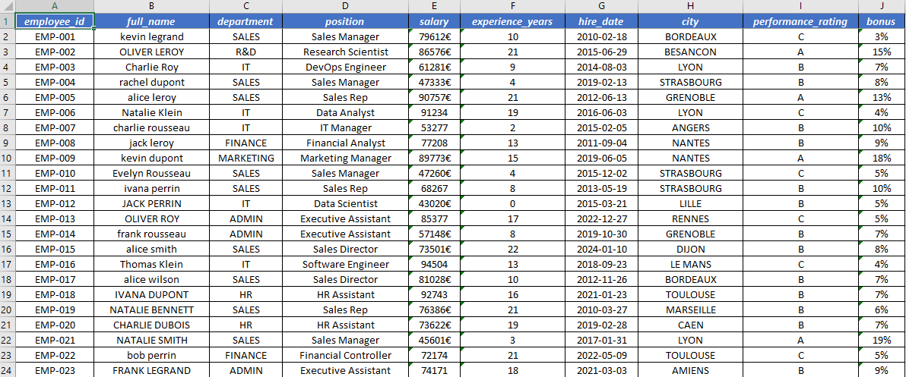
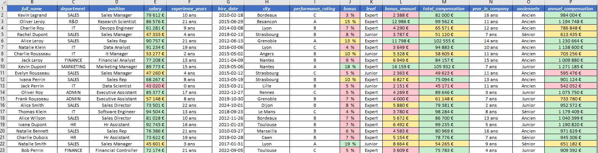
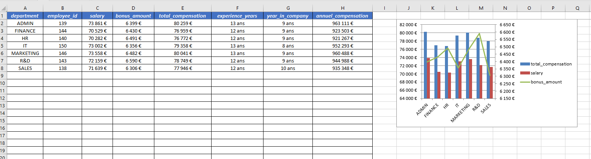
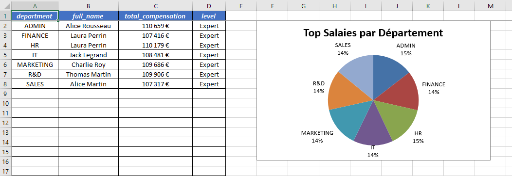
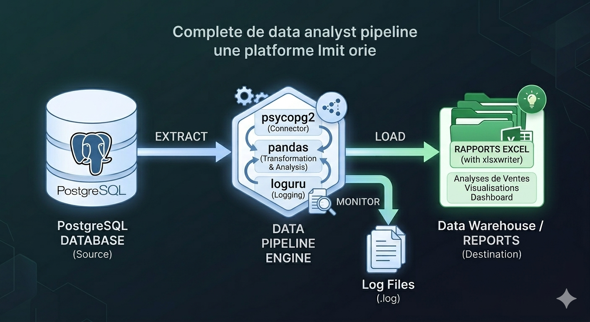

# 👥 HR Analytics Pipeline — ETL & Reporting RH (1 000+ collaborateurs)

Pipeline **ETL (Extract, Transform, Load)** robuste et modulaire pour l'analyse des ressources humaines. Il transforme des données brutes hétérogènes (employés, salaires, ancienneté, performance) en rapports Excel décisionnels automatisés, à destination des Directions des Ressources Humaines.

**Fonctionnalité clé** : Extraction depuis **PostgreSQL** (via `psycopg2`) avec mécanisme de retry exponentiel, nettoyage avancé, feature engineering RH, 5 axes d'analyse métier et génération automatisée de tableaux de bord Excel avec graphiques combinés et mise en forme conditionnelle.

---

## 🏢 Contexte & Enjeux

Simuler les besoins analytiques d'une grande entreprise (1 000 collaborateurs) en fournissant une vision **macro** (statistiques globales par département, niveau, ancienneté) et **micro** (top salaires, performance individuelle) de la structure sociale — le tout automatisé et reproductible à chaque exécution.

---

## 🌟 Points Forts

| Fonctionnalité | Description |
|---|---|
| **Connectivité PostgreSQL** | Extraction robuste avec `psycopg2` et retry exponentiel (3 tentatives, délai x2) |
| **Sécurité** | Credentials PostgreSQL externalisés via `python-dotenv` — aucun secret dans le code |
| **Architecture Modulaire** | Séparation stricte : extraction → nettoyage → features → analyses → reporting |
| **Nettoyage Robuste** | `pd.to_numeric(errors='coerce')` sur toutes les conversions — zéro plantage sur valeurs invalides |
| **Feature Engineering** | Ancienneté, niveau d'expérience, compensation annuelle, montant de bonus calculés automatiquement |
| **5 Axes d'Analyse Métier** | Département, Level, Ancienneté, Performance Rating, Top Salaires par Département |
| **Reporting Excel Avancé** | 7 onglets, graphiques combinés (colonne + ligne sur axe secondaire), camembert, mise en forme conditionnelle |
| **Logging Professionnel** | Loguru avec rotation 10 MB, rétention 30 jours, compression ZIP, horodatage |
| **Configuration Centralisée** | Chemins, seuils, couleurs, paramètres DB et retry tous gérés dans `config.py` |
| **Tests Unitaires** | Couverture pytest sur `clean.py` et `features.py` — 17 assertions vérifiées |

---

## 🛠️ Architecture du Projet

```
hr-analytics-pipeline/
├── images/
│   ├── output_excel/          # 📸 Captures d'écran du rapport généré
│   └── architecture/          # 🏗️ Diagramme d'architecture
├── src/
│   ├── analysis/
│   │   ├── __init__.py
│   │   ├── analysis_department.py      # 📊 Analyse par département
│   │   ├── analysis_level.py           # 📊 Analyse par niveau d'expérience
│   │   ├── analysis_anciennete.py      # 📊 Analyse par ancienneté
│   │   ├── analysis_perf_rating.py     # 📊 Analyse par performance
│   │   └── analysis_top_sal_dep.py     # 📊 Top salaires par département
│   ├── __init__.py
│   ├── extract.py             # 📥 Extraction PostgreSQL (retry exponentiel)
│   ├── clean.py               # 🧹 Nettoyage et normalisation
│   ├── features.py            # ✨ Feature engineering RH
│   ├── report.py              # 📊 Moteur de rendu XlsxWriter
│   └── logger.py              # 📝 Configuration Loguru
├── tests/
│   ├── __init__.py
│   ├── test_clean.py          # ✅ Tests unitaires nettoyage (9 assertions)
│   └── test_features.py       # ✅ Tests unitaires features (8 assertions)
├── data/
│   ├── raw/                   # 💾 Données sources (ignorées par Git)
│   └── processed/             # 🔄 Données nettoyées (ignorées par Git)
├── logs/                      # 📜 Logs horodatés (ignorés par Git)
├── Output_excel/              # 📂 Rapports générés (ignorés par Git)
├── .env                       # 🔐 Credentials PostgreSQL (ignoré par Git)
├── .env.example               # 📋 Template de configuration
├── config.py                  # ⚙️ Configuration centralisée
├── main.py                    # 🚀 Point d'entrée du pipeline
├── requirements.txt           # 📦 Dépendances
└── README.md                  # 📖 Documentation
```

---

## ⚙️ Configuration (`config.py` + `.env`)

Toute la configuration est centralisée dans `config.py`. Les credentials PostgreSQL sont externalisés dans un fichier `.env` non versionné.

**`.env.example`** (à copier en `.env` et remplir) :
```
DB_HOST=localhost
DB_PORT=5432
DB_NAME=hr_db
DB_USER=votre_user
DB_PASSWORD=votre_mot_de_passe
TABLE=rh_table
```

**`config.py`** :
```python
from dotenv import dotenv_values

env = dotenv_values(".env")

DB_CONFIG = {
    'host': env['DB_HOST'],
    'port': int(env['DB_PORT']),
    'dbname': env['DB_NAME'],
    'user': env['DB_USER'],
    'password': env['DB_PASSWORD']
}
```

---

## 📊 Pipeline ETL — Flux de Données

```
PostgreSQL (psycopg2)
        ↓
  extract.py          → Extraction avec retry exponentiel
        ↓
   clean.py           → Normalisation texte, conversion devises/dates/bonus
        ↓
  features.py         → Level, ancienneté, bonus_amount, compensation annuelle
        ↓
  analysis/ (x5)      → Agrégations par département, level, ancienneté, perf, top salaires
        ↓
   report.py          → Rapport Excel 7 onglets avec graphiques et mise en forme conditionnelle
```

---

## 📈 Rapport Excel Automatisé

| Onglet | Contenu | Visualisation |
|---|---|---|
| Données Brutes | Données extraites de PostgreSQL | — |
| Données Nettoyées au Complet | Données après nettoyage + features | Mise en forme conditionnelle (salary, bonus, compensation) |
| Données Par Département | Agrégations RH par département | Graphique combiné colonne + ligne (axe secondaire) |
| Données Par Level | Statistiques par niveau d'expérience | Graphique combiné colonne + ligne |
| Données Par Ancienneté | Analyse par tranche d'ancienneté | Graphique combiné ligne + colonne |
| Données Par Performance | Salaires moyens par note de performance | Graphique en colonnes |
| Top Salaires par Département | Top N collaborateurs par département | Graphique camembert avec pourcentages |

---

## 📸 Aperçu du Rapport






---

## 🏗️ Diagramme d'Architecture



---

## ✅ Tests Unitaires

Le projet est couvert par des tests unitaires `pytest` sur les deux fonctions de transformation principales.

```bash
pytest tests/ -v
```

```
tests/test_clean.py::test_cleaning_make_df       PASSED
tests/test_features.py::test_add_features        PASSED

2 passed in 2.14s
```

Les tests vérifient : normalisation des textes, conversion devises/bonus/dates, feature engineering (level, ancienneté, compensations).

---

## 🔧 Dépendances

| Bibliothèque | Version | Utilité |
|---|---|---|
| `psycopg2-binary` | 2.9.11 | Connexion PostgreSQL |
| `pandas` | 2.0.3 | Manipulation et nettoyage des données |
| `loguru` | 0.7.3 | Logging structuré avec rotation |
| `xlsxwriter` | 3.2.9 | Génération de rapports Excel avancés |
| `python-dotenv` | 1.0.0 | Gestion sécurisée des credentials |
| `pytest` | 9.0.3 | Tests unitaires |

---

## 🚀 Installation & Lancement

```bash
# 1. Cloner le dépôt
git clone https://github.com/SopeTaha92/hr-analytics-pipeline.git
cd hr-analytics-pipeline

# 2. Créer l'environnement virtuel
python -m venv venv
venv\Scripts\activate        # Windows
# source venv/bin/activate   # Linux/Mac

# 3. Installer les dépendances
pip install -r requirements.txt

# 4. Configurer les credentials PostgreSQL
cp .env.example .env
# Éditer .env avec vos paramètres de connexion

# 5. Lancer le pipeline
python main.py

# 6. Lancer les tests
pytest tests/ -v
```

---

## 📅 Prochaines Étapes

- [ ] Dashboard interactif avec **Streamlit** ou **Power BI**
- [ ] Optimisation SQL : index sur `employee_id` et `hire_date`
- [ ] Prédiction du turnover avec **scikit-learn**
- [ ] Tests d'intégration sur le pipeline complet
- [ ] Orchestration avec **Apache Airflow** ou **Prefect**

---

## 🔗 Autres Projets

[**Pipeline E-commerce**](https://github.com/SopeTaha92/Projet_vente_e-commerce) — Pipeline ETL ventes avec double connectivité PostgreSQL (`psycopg2` + `pg8000`)

---

## 📝 Licence

Ce projet est open source et disponible sous la licence **MIT**.

---

## 👨‍💻 Auteur

**Mahmoud At-Tidiane** — Passionné par l'ingénierie des données, l'analyse décisionnelle et l'intégration PostgreSQL.

- GitHub : [@SopeTaha92](https://github.com/SopeTaha92)
- Projet : [hr-analytics-pipeline](https://github.com/SopeTaha92/hr-analytics-pipeline)
